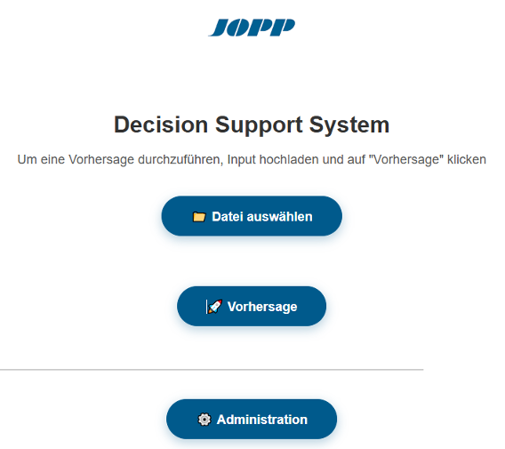
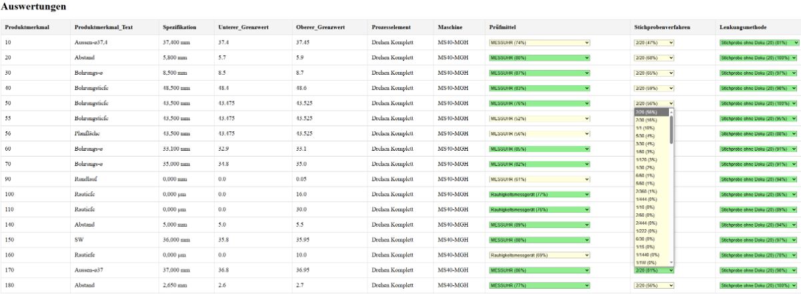
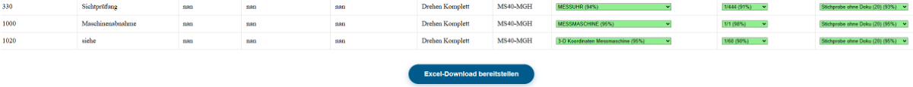
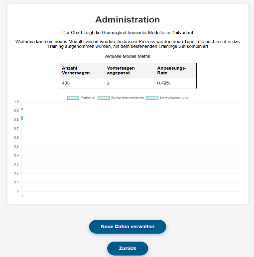

Tool Overview
=============

This section provides a brief insight into the main functionalities of the tool and explains their purpose.

Landing Page
------------
The landing page is designed to provide users with a clear and concise overview of the tool’s functionalities. It is divided into two main sections: the prediction area and the administration area.

Control Plan Creation
---------------------
On the “Control Plan Creation” page, the completed prediction is displayed. Here, the user still has the option to adjust the predicted values. Additionally, color coding is used to indicate whether the prediction probability exceeds 75% or not. By clicking the submit button, the table containing the finalized values can be downloaded as an Excel file.

Administration
--------------
The Administration section provides both short-term and long-term quality assurance functionalities. In the short term, users gain an overview of the current predictive performance of the model generation through key metrics such as the number of predictions, the number of manual adjustments, and the resulting adjustment rate. This allows users to directly assess how reliable the current model is.

In the long term, a dynamic chart displays the development of predictive accuracy across different model generations. This visualization supports ongoing quality monitoring and ensures that any fluctuations or improvements in predictive power over time can be tracked and evaluated. Additionally, the interface allows users to manage and upload new data to continuously improve and retrain the model.

The administration page is additionally protected by a login form to prevent unauthorized access, ensuring that only authorized users can execute the retraining function.

Tool Improvement
----------------
