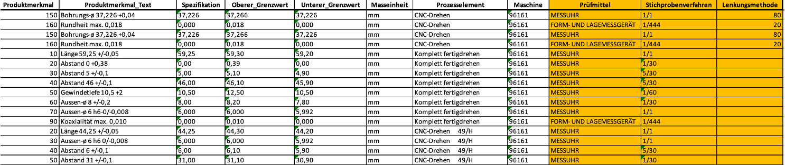

Use Case
========

During the FMEA inception phase for a new component, a control plan is created that defines how and with which tools each specific characteristic of the component should be validated. In the current process, these variables are manually defined during an audit conducted with experts and are the orange marked columns in the screenshot below. This approach is not only time-consuming but also prone to human error due to its subjective nature.

The goal of our project was to address these challenges by developing a system that reduces the time required for creating control plans, thereby lowering overall costs. At the same time, we aimed to minimize the risk of human error through the use of standardized and data-driven decision-making processes.
